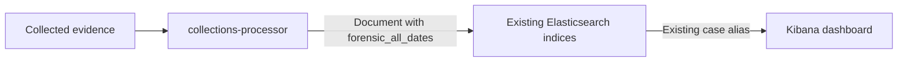

# Multi Date Forensic Search High Level Design

**Status:** Proposed design. The choice between a new dashboard and an update to the existing dashboard remains open.

**Date:** 5 October 2026

## Purpose and scope

Enable investigators to find an evidence document when **any of its relevant forensic dates falls within the selected period**. A search based only on `@timestamp` can miss a document whose creation, modification or access date falls inside that period.

The solution adds a derived date field during collection processing and uses it in the Kibana dashboard. Each matching document remains a single search result, even when several of its dates match.

The feature applies to new cases from their first import, including subsequent imports into those cases. Historical backfill is outside the production scope. Existing evidence fields and `@timestamp` remain available.

## Solution overview

**`forensic_all_dates`** is a new multi-valued date field: a single field containing an array of the relevant forensic dates already present in an evidence document, such as creation, modification and access dates. It provides one common target for time-based searches across those dates, while the original fields retain their individual meaning. Acquisition time is excluded.

`collections-processor` will populate this field before sending each evidence document through the existing indexing flow. Elasticsearch will store and query it using its existing capabilities. Kibana will use it for temporal selection and the histogram.

| Component | Responsibility | Required work |
|---|---|---|
| `collections-processor` | Build the forensic date array for each evidence document. | Add document enrichment to the existing processing flow. |
| Elasticsearch | Index the enriched documents and serve searches and date histograms. | **No Elasticsearch-side implementation or operational changes.** Reuse the existing indexing and search capabilities. |
| Kibana | Select and display documents using the new field, and present their distribution over time. | Configure a new dashboard or update the existing one; align its time controls, results and histogram. |

The existing organization of indices by case and artifact source is retained. The dashboard continues to search through the existing case alias. No separate timeline index, document duplication or additional service is introduced.

## Document enrichment in collections-processor

The processor will use the **mappings provided by the Incident Response team** to identify the date fields for each supported artifact source. It will then copy the values present in those fields in each evidence document into `forensic_all_dates`, applying the inclusion and exclusion rules below. The mappings define which fields supply the dates; the date values themselves come from the evidence document.

The enrichment must:

- Include the eligible original forensic date fields identified by the Incident Response team's mappings. Do not use `@timestamp` as a source: it already copies one of those dates.
- **Exclude `acquisition_time`**. Acquisition metadata remains available in its original field.
- Preserve original ISO date strings, including their fractional digits and timezone representation, so analysts can compare them directly with the source fields.
- Remove identical strings from the derived array. If an eligible evidence field has the same timestamp as `acquisition_time`, that timestamp remains eligible through the evidence field.
- Leave all original evidence fields unchanged. They retain the meaning of each date, such as access or modification; the array alone does not retain those field names.

At a minimum, `forensic_all_dates` will contain the same date as `@timestamp`, taken from the original forensic field that supplies it.

Date validation and handling of unusable values belong to the processing flow. Field selection must follow the Incident Response team's mappings consistently across artifact sources; arbitrary strings must not be treated as dates simply because they resemble timestamps.

### Example: MFT record

For example, a document representing an MFT record could contain the following dates. All times shown here are UTC.

| Source fields | Original date value |
|---|---|
| `mft.fn_atime`, `mft.fn_ctime`, `mft.fn_mtime` | `2026-03-23T18:23:55.4739326+00:00` |
| `mft.fn_btime` | `2026-03-24T01:09:47.8609249+00:00` |
| `mft.si_ctime`, `mft.si_mtime` | `2026-04-08T15:32:59.2831915+00:00` |
| `mft.si_atime` | `2026-07-02T18:41:34.1708833+00:00` |

The resulting array contains **four distinct dates**. In this record, `@timestamp` is a copy of `mft.fn_btime`, so the date is taken directly from `mft.fn_btime`. The separate acquisition date, `2026-07-02T18:40:39Z`, is excluded.

If an investigator selects **8 April 2026** in the dashboard, this document appears in the results because `forensic_all_dates` includes that date, copied from `mft.si_ctime` and `mft.si_mtime`. A search based only on `@timestamp` would miss the document, since that field contains **24 March 2026**. Although two original fields contain the date being searched for, they belong to the same document, so the results table shows **one row**.

## Elasticsearch

**No separate Elasticsearch changes are planned.** The design uses the existing cluster, indices, case aliases and native support for fields containing multiple dates. Searches and histograms operate on the stored field; it is not calculated for every query.

## Kibana dashboard

The dashboard will use `forensic_all_dates` consistently for the time selector, automatic time filters, histogram and results table configuration. Changing the histogram alone is insufficient if document selection still uses `@timestamp`.

Other analyst filters continue to apply. Explicit constraints on an original date field remain independent criteria. The results table shows one row per matching document and allows the analyst to inspect the original fields to understand why it matched.

A **proof of concept (PoC)** was carried out by creating an example dashboard. It uses `forensic_all_dates` for the time filter, histogram, table time field and descending sort, with a time selector associated with the same field.

**Filtering determines which documents appear; sorting determines their order in the table.** With the standard descending sort configured in the PoC, documents are ordered by the most recent date in `forensic_all_dates`. For example, the MFT document above is found when searching for **8 April 2026**, while its **2 July 2026** date determines its position in the table. Every returned document still matches the selected period and appears only once; the sort simply places those with the most recent forensic dates first.

### Open decision on dashboard delivery

| Option | User-facing outcome |
|---|---|
| Create a new dashboard | Investigators access a dedicated multi-date view while the current dashboard remains available for its existing use. |
| Update the existing dashboard | The existing entry point adopts the multi-date behavior for supported cases; its handling of older cases must remain explicit. |

**This decision has not been made.** It affects navigation and rollout, not the data enrichment or histogram semantics described in this HLD. Multi-date behavior must be enabled only for cases whose imports populate the field consistently.

## How to read the histogram

The results table remains straightforward to read: apart from the sorting behavior described above, each matching document continues to appear only once. The histogram needs a little more explanation because a document can contain dates in several periods and therefore contribute to more than one bar. Understanding how those dates are grouped makes it easier to relate the chart to the documents in the table.

Each bar represents a period and shows **the number of matching documents with at least one included forensic date in that period**.

The date shown on a bar is the **start of the period**, not the exact time of an event. Several dates may fall into one bar. A document counts once within a period, even if several of its dates fall there, and can count again in another period.

Consequently, the sum of the bars is not the number of unique search results and is not the number of individual timestamps. The dashboard must distinguish **documents per period** from **total matching documents**, rather than presenting the sum of the bars as an unqualified “hits” total.

### Four dates grouped into three periods

Using the MFT example above, with a selected window covering **March through July 2026**, a fixed **30-day interval** produces three non-empty bars:

| Bar label in the dashboard timezone | Included document dates, in UTC | Documents counted |
|---|---|---|
| 8 March 2026, 01:00 | 23 March and 24 March | 1 |
| 7 April 2026, 02:00 | 8 April | 1 |
| 6 June 2026, 02:00 | 2 July | 1 |

All four dates are represented. The two March dates share a period. The July date belongs to the 30-day period beginning on 6 June, so a June label can correctly contain a July date. Fixed 30-day periods are not calendar months.

In this example, the periods begin at midnight UTC. The dashboard timezone uses UTC+1 in winter and UTC+2 in summer, so the labels show 01:00 and 02:00 respectively. The display timezone changes the label, not the underlying instant.

The table contains **one document**, while the chart contains **three bars of height 1**. Selecting a daily interval would separate the March dates and produce four bars. Automatic interval selection may choose broader periods when the displayed time range is large.
